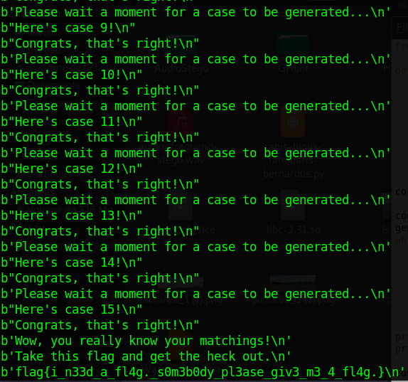

# extended-fibonacci-sequence-2 (186 solves / 417 points)
**Description :** *fibs r so much fun here's another one*

**Given files :** *Extended Fibonacci Sequence 2 ACTUALLY ACTUALLY ACTUALLY NEW.pdf*

### Write-up :
This challenge is pretty straightforward, you just need to code the given formulas given in the pdf explaining the problem. No particular optimization is needed here to solve the challenge, you can find an example (***fibs.py***) of a very basic (unoptimized) solution including how to interact with the remote server.

You can see below an example of the result of the mentioned script :

`flag{i_n33d_a_fl4g._s0m3b0dy_pl3ase_giv3_m3_4_fl4g.}`