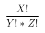
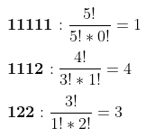
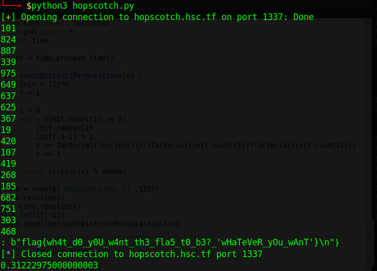

# ehopscotch (151 solves / 436 points)
**Description :** *Keith wants to play hopscotch, but in order to make things interesting, he decides to use a random number generator to decide the number of squares n to draw for a round of hopscotch. He then creates a hopscotch board on the floor by randomly creating a sequence of ones (one square) and twos (two squares) such that the sum of all the numbers in the sequence is n. Given 1 <= n <= 1000, find the number of valid hopscotch boards (mod 10000) he can create.*

**Given information :** *Sample Input: 5 --> Sample Output: 8*

### Write-up :
This time, you'll need some maths knowledge to solve the challenge but don't worry, having internet works fine aswell if you didn't attend any class related to permutations, combinations etc or just don't remember those.

First of all, what are we supposed to find here ? If we forget about the context and just rationalize the problem, given a number n betwen 1 and 1000 included, we need to find the number (modulo 10000) of distinct sequences made of 1s and 2s that once summed up are equal to n. Let's have a look to the example we've been given with n = 5.

We can have the following sequences :

    - 11111 --> 1+1+1+1+1 = 5
    - 1112 --> 1+1+1+2 = 5
    - 1121 --> 1+1+2+1 = 5
    - 1211 --> 1+2+1+1 = 5
    - 2111 --> 2+1+1+1 = 5
    - 122 --> 1+2+2 = 5
    - 212 --> 2+1+2 = 5
    - 221 --> 2+2+1 = 5

We do have 8 distincts sequences here which is the output we expected.

Doing this is equivalent to enumerate all the distinct permutations of a specific set of items (11111,1112,122) and some libraries exists to simplify works related to these topics so at first, I didn't really think and just go for the easy (but impossible) way which was to calculate all the possible permutations and count the one we're interested but it represents a really huge number of permmutations so depending on your computer and the time you have, you might be able to do it for up to n equals a few dozens but then, you (or your computer) would finally die before getting the flag you're craving for.

So, second option : relying on mathematics. A formula exists to calculate the number of possible permutations for a given set of items without needing to actually go through all of them. So that's nice, now we'll just need to go through each possible set of items, which is a lot less than the number of permutations, and apply a formula to it.

Where : 
&nbsp;&nbsp;&nbsp;&nbsp;&nbsp;&nbsp;&nbsp;&nbsp;X = length of the sequence
&nbsp;&nbsp;&nbsp;&nbsp;&nbsp;&nbsp;&nbsp;&nbsp;Y = number of 1 in the sequence
&nbsp;&nbsp;&nbsp;&nbsp;&nbsp;&nbsp;&nbsp;&nbsp;Z = number of 2 in the sequence

Let's check it our initial example :

1 + 4 + 3 = 8, we're back with the expected output. It might seem more complicated than it was earlier but it's much more efficient and if you didn't realize it already, just have a look to the results :

As you can see, we got our flag in less than 0.4 second which is quite quick especially when we remember that we couldn't solve the problem from n = 40 or so and here we even solved it for n = 975.

Ultimately, we got our flag which is `flag{wh4t_d0_y0U_w4nt_th3_fla5_t0_b3?_'wHaTeVeR_yOu_wAnT'}`
