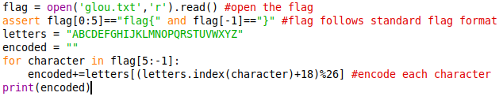
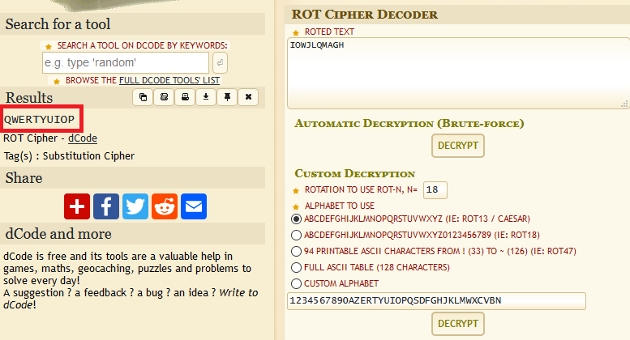

# aptenodytes-forsteri (597 solves / 183 points)
**Description :** *Here's a warmup cryptography challenge. Reverse the script, decrypt the output, submit the flag.*
**Given files :** *aptenodytes-forsteri.py* and *output.txt*

### Write-up :
Let's have a look to the script we have.

We can see that the script is getting our flag from text file then he ignores the characters that are a part of the flag format, so `flag{}`, and encrypt what's supposed to be inside the brackets. To do so, it uses a simple rotation cipher, you can easily reverse it or do through any of the multiple online tools that exists. Here is the output we got when providing [**dcode's ROT solver**](https://www.dcode.fr/chiffre-rot) with the encrypted flag we've `IOWJLQMAGH` :

`flag{QWERTYUIOP}`