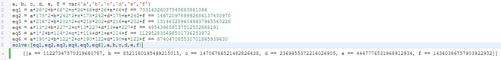

# cyanocitta-cristata-cyanotephra-but-fixed (94 solves / 464 points) and cyanocitta-cristata-cyanotephra (100 solves / 461 points)
**Description :** *The Blue Jay (Cyanocitta cristata) is a passerine bird in the family Corvidae, native to North America. It is resident through most of eastern and central United States and southern Canada, although western populations may be migratory. It breeds in both deciduous and coniferous forests, and is common near and in residential areas. It is predominately blue with a white chest and underparts, and a blue crest. It has a black, U-shaped collar around its neck and a black border behind the crest. Sexes are similar in size and plumage, and plumage does not vary throughout the year. Four subspecies of the Blue Jay are recognized.*

**Given files :** *cyanocitta-cristata-cyanotephra.sage* and *output.txt*

### Write-up :
/!\ This solution was the intended one, it then works for both the initial and fixed versions of the challenge. The fixed version is used as the example below but you can just adapt the coefficients to get it working with the first challenge. /!\

/!\ The initial version was kinda trivial because of the size of the flag, I let you find why ;) /!\

So we got the following Sagemath worksheet :

The flag is taken as hexa from a text file then some processing is done on it to provide the following output with the last line being our encrypted flag :

We can see that the final operation is just a XOR between the result of the mathematical function defined earlier and the flag we want. Since a XOR can be undone easily, to get the flag back we need to XOR the result of **f(a,b)** and the result of the last XOR, **19440293474977244702108989804811578372332250**.

The variables **a** and **b** are part of the output so what we need to get **f(a,b)** is to find the values of **c** which is a list of 9 numbers between 1 and 2^64. Good news, since the function f only uses the first 6 numbers of this list, we don't really care about the 3 last.

Hopefully, we've been given a test case to help find out these values. Two differents list, **xs** and **ys**, are created at the beginning of the worksheet and each of those consists of 9 random numbers between 1 and 256. Then, in the output we have, we can see 9 results for `f(Xi,Yi)` and from that results, we can solve a system equation to identify the variables we need. Since we need to identify 6 variables, 6 equations will be enough so let's just ignore the last three cases and get what we need. Thanks to Sagemath, this step is quite trivial. We just need to put together the definition of the function f and the results we have in the output file to define the needed equations :

Now that we've the 5 variables used to define the function f, we can just do the necessary calculation to retrieve our flag which consists of `f(a,b) XOR OutputResult` then convert this from int to hex and from hex to string :

`flag{d8smdsx01a0}`