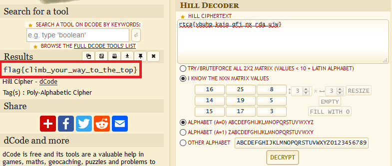

# queen-of-the-hill (514 solves / 221 points)
**Description :** *After finding a special key of the Hill, which contains a note to visit the Queen of the Hill, our brave Amanda begins her adventure to find the Queen of the Hill’s treasure. How shall she meet the Queen of the Hill? (a=0)*

**Given information :**
&nbsp;&nbsp;&nbsp;&nbsp;&nbsp;&nbsp;&nbsp;&nbsp;*Cipher text: `rtca{vbuhp_kaiq_gfj_nx_rda_ujw}`*
&nbsp;&nbsp;&nbsp;&nbsp;&nbsp;&nbsp;&nbsp;&nbsp;*Encryption key:*
&nbsp;&nbsp;&nbsp;&nbsp;&nbsp;&nbsp;&nbsp;&nbsp;&nbsp;&nbsp;&nbsp;&nbsp;&nbsp;&nbsp;&nbsp;&nbsp;*16 25 8*
&nbsp;&nbsp;&nbsp;&nbsp;&nbsp;&nbsp;&nbsp;&nbsp;&nbsp;&nbsp;&nbsp;&nbsp;&nbsp;&nbsp;&nbsp;&nbsp;*14 19 5*
&nbsp;&nbsp;&nbsp;&nbsp;&nbsp;&nbsp;&nbsp;&nbsp;&nbsp;&nbsp;&nbsp;&nbsp;&nbsp;&nbsp;&nbsp;&nbsp;*15 17 3*

### Write-up :
*Hill* seems important here and after a quick search, we can discover the **Hill Cipher**. Let's use some online tool to solve it since we already everything we need :

`flag{climb_your_way_to_the_top}`