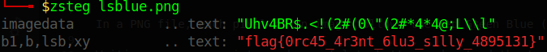

# LSBlue (516 solves / 220 points)
**Description :** *Orca watching is an awesome pastime of mine!*
**Given files :** *lsblue.png*

### Write-up :
The flag is clearly hidden somewhere in the given image and we've an obvious clue in the name of the challenge and the name of the image. This name is related to a well know steganography technique, which consists of hiding data through the LSB (Least Significant Bit) of each pixel of an image. 

In a PNG file, each pixel of an image follows the Red Green Blue (RGB) model so basically, one pixel is equal to three bytes, one for each color. Technically, you can alter the least significant bit of each of this byte without visually altering the image but the title of the challenge suggests that the flag we're looking for is has been hidden in the "blue byte" only.

Writing your own script can be useful to better understand the technique but there are already a lot of tools that can solve this for you. One of the best for this kind of technique is ***zsteg*** that can look for a lot of possible combinations and extract the flag for you so if you could think of the LSB technique and find this tool, it was won.

`flag{0rc45_4r3nt_6lu3_s1lly_4895131}`