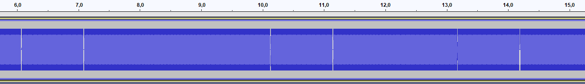

# audio-frequency-stego (108 solves / 457 points)
**Description :** *What a mundane song, it's just the same note repeated over and over. But could there perhaps be two different notes?*
**Given files :** *audio_frequency_stego.wav*

### Write-up :
Here we've a stego chall with an audio file. First thing I've done was to open it with tools such as Sonic Visualizer hoping I could find something interestingg directly in the spectrogram for instance but it wasn't the case and I couldn't extract anything directly with know tools.

WHen you listen to the file you can here a sound repeatedly for about 3 minutes every +/- 1 second and when you look at the audio track with Audacity or Sonic Visualizer and zoom a bit, you can see that even if the sound seems to be always the same, it might not be after all.

/!\ Keep in mind that this solution is not efficient at all but quite straightforward, which was enough for me since the audio lasts for about 3min only /!\

I didn't use any tool, didn't automate anything and didn't use any advanced features of Audacity. Since we could definitely see two cases, I assigned the continuity to a 0 and the blanks to a 1.

A few minutes later, you've some binary and you just need to convert it to ASCII and you got your flag.
