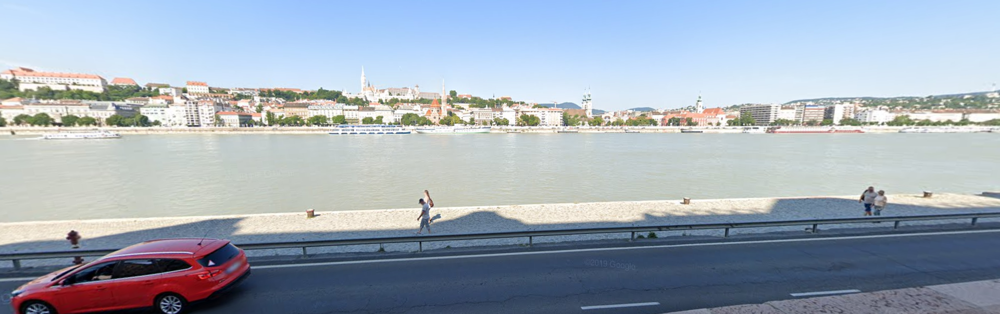
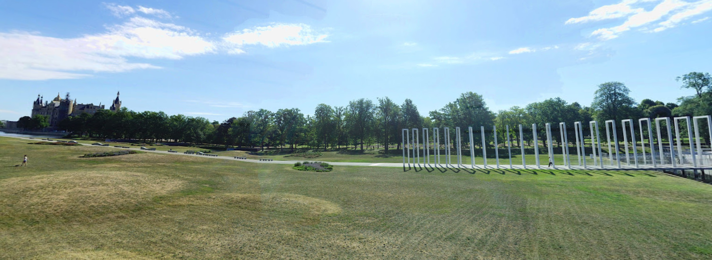
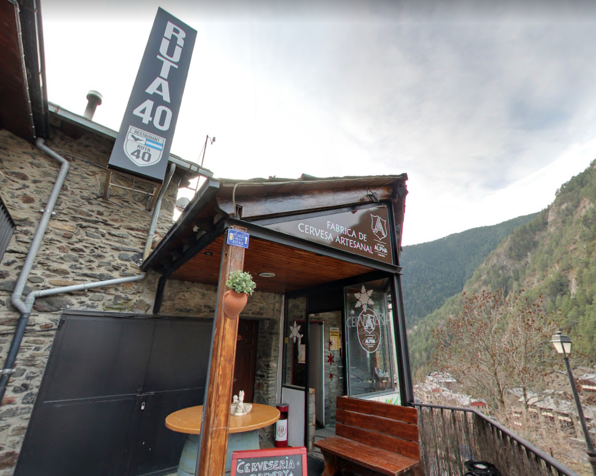

# geographic-mapping-2 (105 solves / 459 points)
**Description :** *Find the coordinates of each location - now with three coordinates!

Flag format: flag{picture1 latitude,picture1 longitude,picture2 latitude,picture2 longitude,picture3 latitude,picture3 longitude}, all latitudes and longitudes to the nearest THREE decimal digits after the period, except for picture 2, which should have TWO decimal digits. No spaces in the flag.

Example format: flag{12.862,48.066,-13.47,-48.37,-13.477,-48.376}. Picture 2 has two decimal digits, while the rest have 3.

The challenge author will not confirm individual locations, nor check your decimal digits. Three decimal digits gives a range of ~111 meters.*
**Given files :** *picture2_1.png*, *picture2_2.png* and *picture2_3.png*

### Write-up :
Second version of the geographic OSINT challenge and this time we've 3 places to locate.

For the first one, there isn't much clue directly in the photo.

Doing a search by image on Google Images, you can find some images that look like ours. Here is an example with an image related to some Youtube video. By checking on Google Translate, we can see that the title is in hungarian.

Now we can had details to our image research, by adding "Hungary" to the search, we can find another image that is similar and that has been taken at Budapest, Hungary.

From there, you can find the exact place on Google Maps thanks to the river and the buildings you can see. First part of the flag : `47.504,19.045`

For the second image, we don't have anything that could be easily and uniquely identified.

This time, we can follow the same process but to be able to get relevant results, you'll need to zoom on the right part of the image, where the thing that looks some piece of modern art is the most identifiable. If you take a too large part of it, Google will consider it to be some kind of fence or something like that and you won't be able to find anything useful.

With the following extract and keywords such as "castle" since we see one in the background, we can find similar images and their location.

From there, you can just confirm the exact location with the satellite view on Google Maps so you can have the second part of the flag : `53.62,11.41`

Finally, let's have a look the third picture which has a lot of displayed information on it.

I won't go into to much details here since this one is quite straightforward. With a simple search on Google with **Ruta 40** and **Cervesa Alpha**, you can find the restaurant on TripAdvisor (first link). You can then validate that's the right location by looking at Google Maps Street View and you found the last part of the flag : `42.569,1.489`

`flag{47.504,19.045,53.62,11.41,42.569,1.489}`