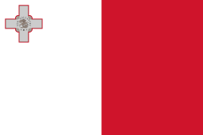
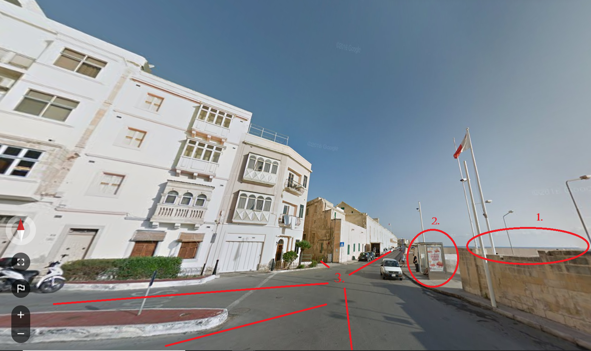
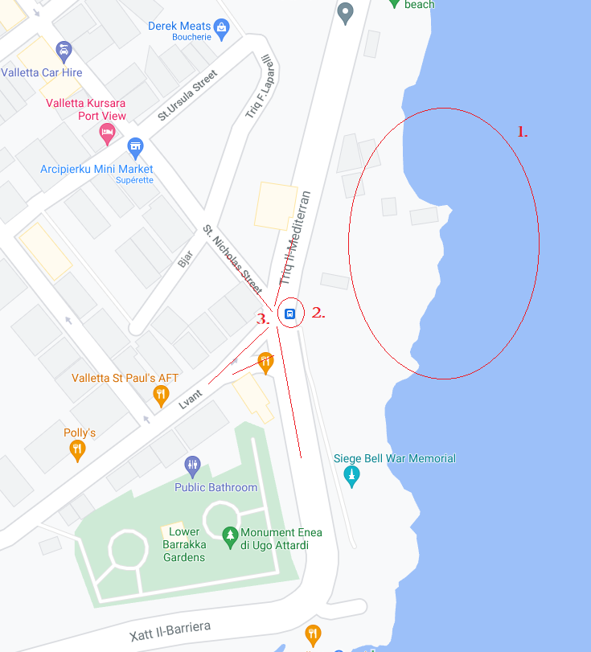
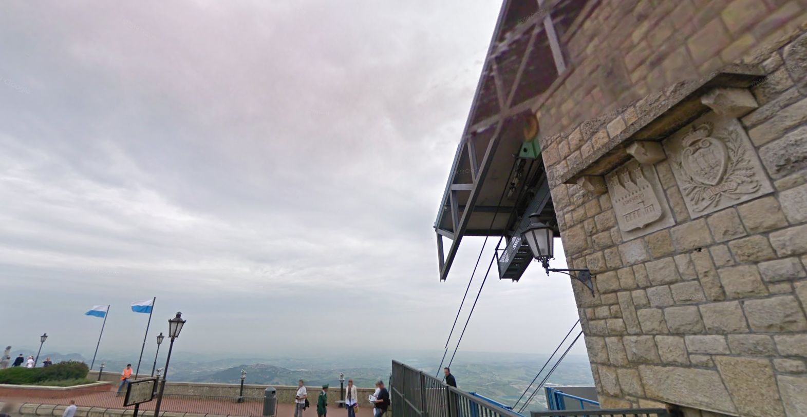
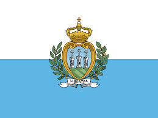
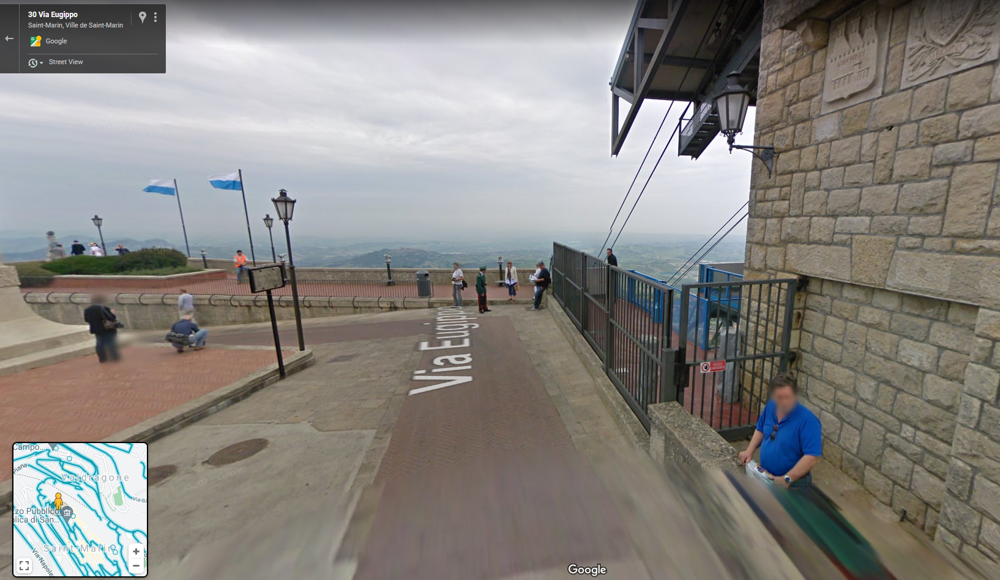

# geographic-mapping (164 solves / 429 points)
**Description :** *Find the coordinates of each location!

Flag format: flag{picture1 latitude,picture1 longitude,picture2 latitude,picture2 longitude}, all latitudes and longitudes to the nearest THREE decimal digits after the period. No spaces in the flag.

Example format: flag{12.862,48.066,-13.477,-48.376} The challenge author will not confirm individual locations, nor check your decimal digits. Three decimal digits gives a range of ~111 meters.*

**Given files :** *picture1.png* and *picture2.png*

### Write-up :
First OSINT challenge, you've two images and you need to find their location. So, let's take the first one :

First clue here is the flag you can see and that might give you a region, a country or something like to start from. After doing some research (Google is your friend), I made the assumption that it was Malta's flag even though it wasn't 100% sure, it looks a lot like it.

Then, I used three informations to try to find this location on Google Maps :

    1. Looks like we can see the sea in the right
    2. There is a bus stop
    3. The position of the streets
    

After some research on Google Maps, we can find the right setup :

You can validate the result with Google StreetView and see that's the right place. You can then click there on Google Maps and it will give you the coordinates, first part of the flag : `35.898,14.518`

Let's have a look to the second image now. 

The start is the same with a new flag. This time, we made the assumption that it was the San Marino flag.

Then, we can see some kind of funicular or cable car and there is only one in San Marino. Finally, we can see that we're where we needed to be, just get the coordinates and you've the second part of the flag : `43.938,12.446`

`flag{35.898,14.518,43.938,12.446}`