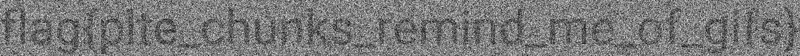

# pallets-of-gold (394 solves / 289 points)
**Description :** *It doesn't really look like gold to me...*

**Given files :** *pallets-of-gold.png*

### Write-up :
Looks like we've another steganography challenge here with this image with a tons of random coloured pixed.

There are many solutions to solve this and I'm gonna present you two different tools to do so :

## 1. StegOnline (https://stegonline.georgeom.net)

This is very powerful online tool for image steganography. It can supports many different techniques. I'll let explore it but here you can see the results when we browse the custom palettes chunks.

## 2.StegSolve (https://github.com/zardus/ctf-tools/blob/master/stegsolve/install)

You can do pretty much the same type of manipulations with this tool. It has also some other options, feel free to test it yourself.

`flag{plte_chunks_remind_me_of_gifs}`