# stonks (231 solves / 391 points)
**Description :** *check out my cool stock predictor!*

**Given files :** *chal*

### Write-up :
Firts pwn challenge of this CTF, we've a binary file. Let's just get basic information about it to see what've exactly.

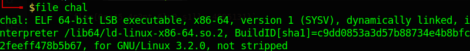

Since we don't have the source code, I've choosed the **Ghidra** way to see what we're up against.

We can see that the main function just print some text and call another function named ***vuln***.

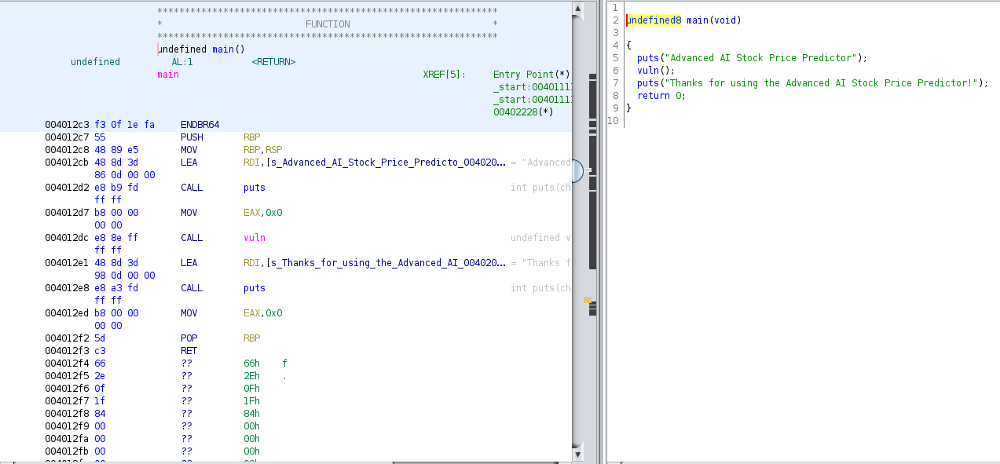

Obvisously, we can expect to find the vulnerability we're going to exploit in this function so let's what we have their :

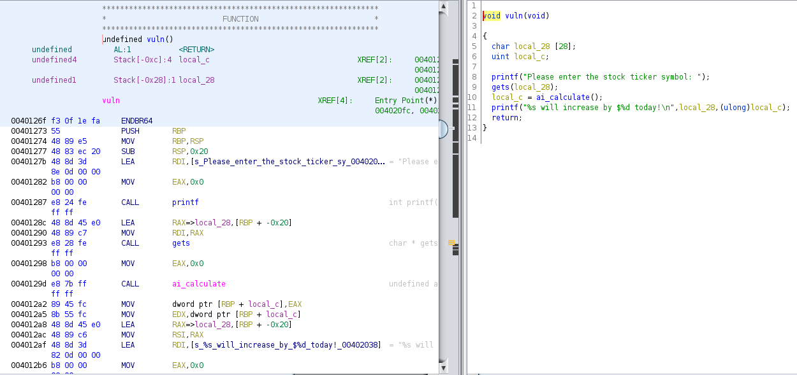

We can spot quickly a **Buffer Overflow** here with the use of **gets()**. This function, unlike **fgets()**, doesn't do any check on the size of the input it gets. It'll just take everything you send as an imput and send it to the variable given as a parameter which is in that case 28 bytes long, meaning that everything sent above that size will be overflowing somewhere it shouldn't.

From there, this kind of vulnerability can allow us to do multiple things so in order to know what is our goal, let's have a look to the rest of the program. We find two other interesting functions : *ai_calculate* called normally by the *vuln* function and another one called *ai_debug*. As you can see below, the first one won't be very useful since it just returns a random integer.

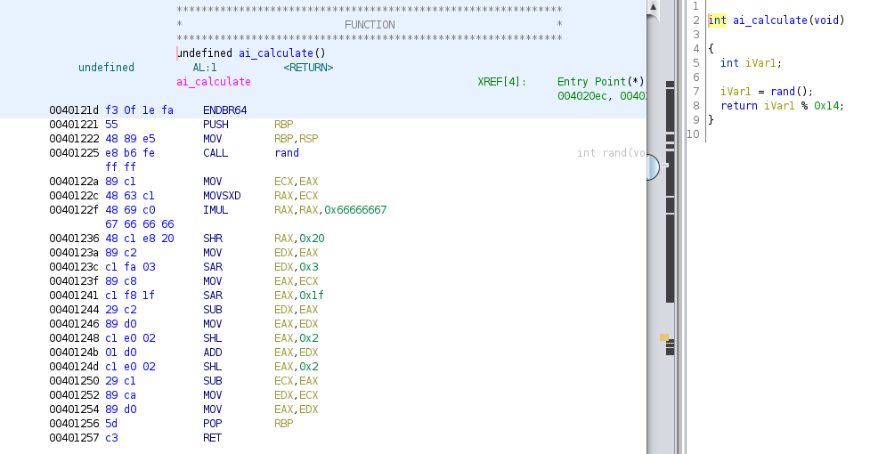

In the other hand, the *ai_debug* function is a lot more interesting since it starts a shell :

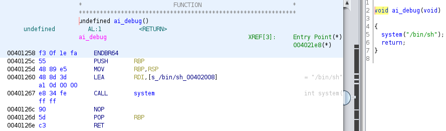

So now, our plan is simple : **Smash the stack !** We're going to try to overflow the instruction pointer register in order to call **ai_debug** and open a shell that will give us access to the remote server that's probably hosting a file with a the flag or something like that. Time to use *GDB** now. First thing we do is to check the potential securities used on the binary that could be a problem.

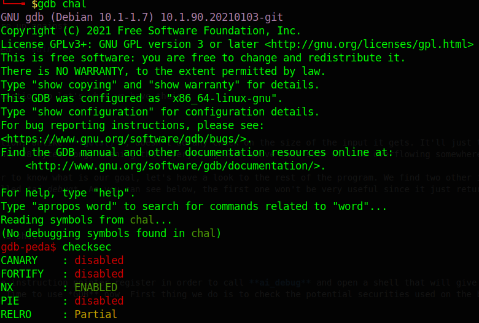

Luckily, nothing here will be a problem for our plan confirming that we're working on the first pwn challenge and not one requiring some mystical pwn skills and knowledge. Let's continue our investigation, we first need to find the right offset to know exactly how many bytes we need to send before accessing **$rip**, the register we talked about earlier. There are plenty of ways to do that but since we're using *gdb-peda*, we'll go on with this tool. Let's create a cyclic pattern first and then send it to our program as an input.

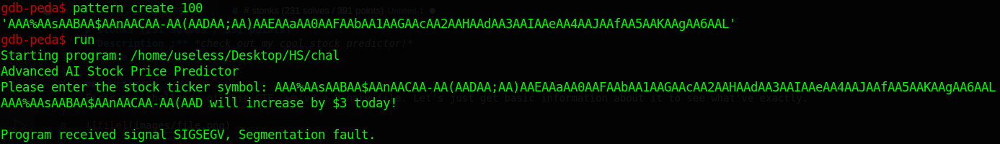

We can see we had a Segmentation Fault due to the buffer overflow. The important part here comes in the rest of the results with the stack content :

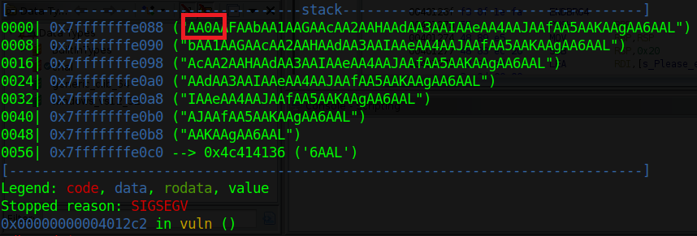

As expected, we overflowed the stack and in order to find the offset we're looking for, we need to take the four first characters we can see on the stack on the screenshot above and provide *gdb-peda* with these :

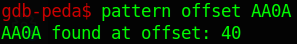

We now have the right offset which is **40**. So we need to send 40 characters as padding followed by **ai_debug's adress** in order to tell the program this is the next instruction it's supposed to execute. Time to get that adress then :

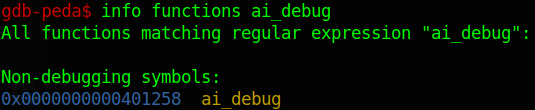

Now, we have our offset (**40**) and the adress we want to aim (**0x401258**) so let's write a script that will handle the connection (to a process for local test or a remote server for the real challenge) and send our payload. You can see a basic Python script that does exactly that :

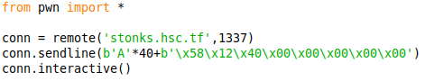

You can also try it locally first with `conn = process('./chal')`. In my case, and maybe yours too, the exploit was working fine like that locally but not on the remote server which is probably running a different environment. Then we got an EOF that stops the connection and prevents us to interact with the shell we opened as you can see below.

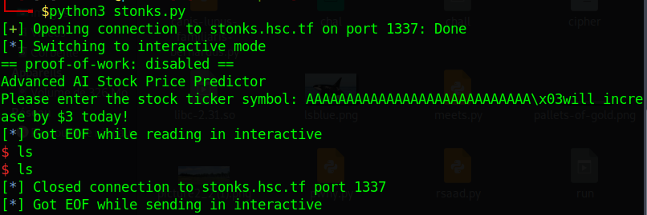

The problem we've here is about stack alignment. You can find plenty information about this on internet so I won't explain it here but our problem is that here, the stack needs to be 16-byte aligned. In order to solve this issue, we can just add an extra **ret** instruction to our payload. In order to do that, we can go back to **gdb**. Here is an example by disassemble the **vuln** function, we take the **ret** adress and add it to our payload :

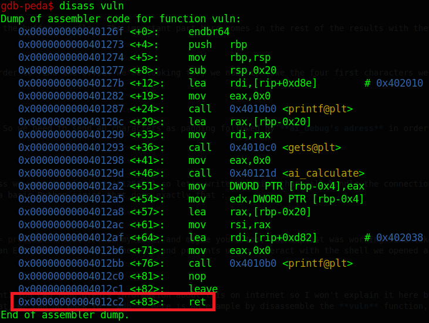

With our updated script, we can now see that everything works fine. We've our remote shell and we can quickly find a file called **flag**. We can then print it and we're done !

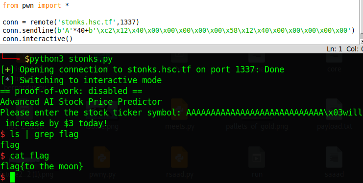

`flag{to_the_moon}`
